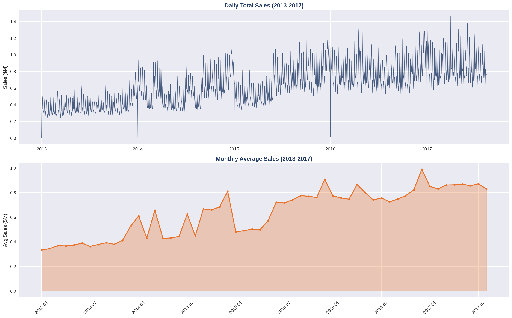
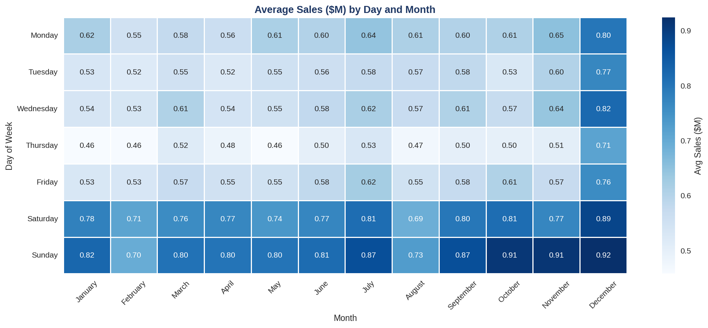
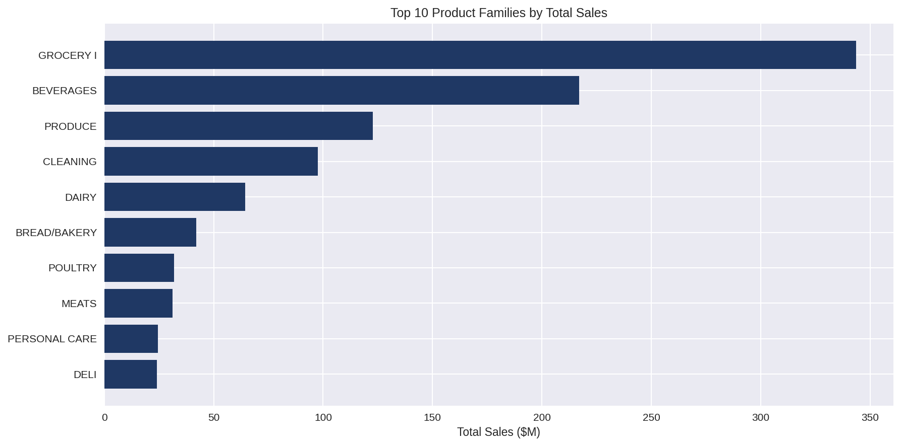
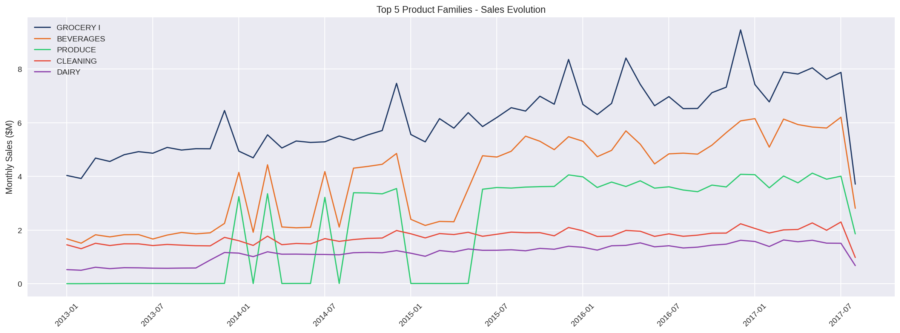
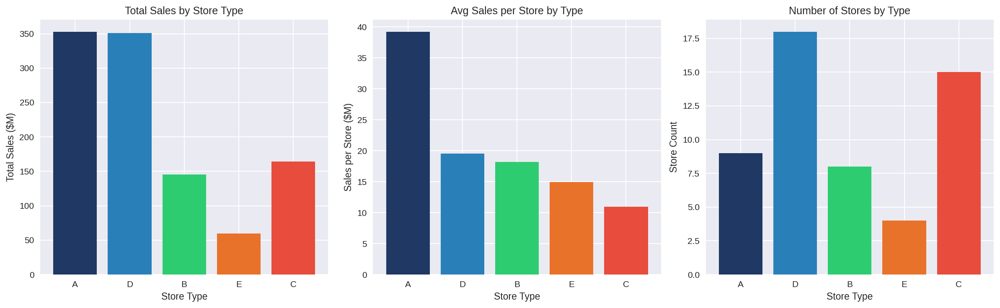
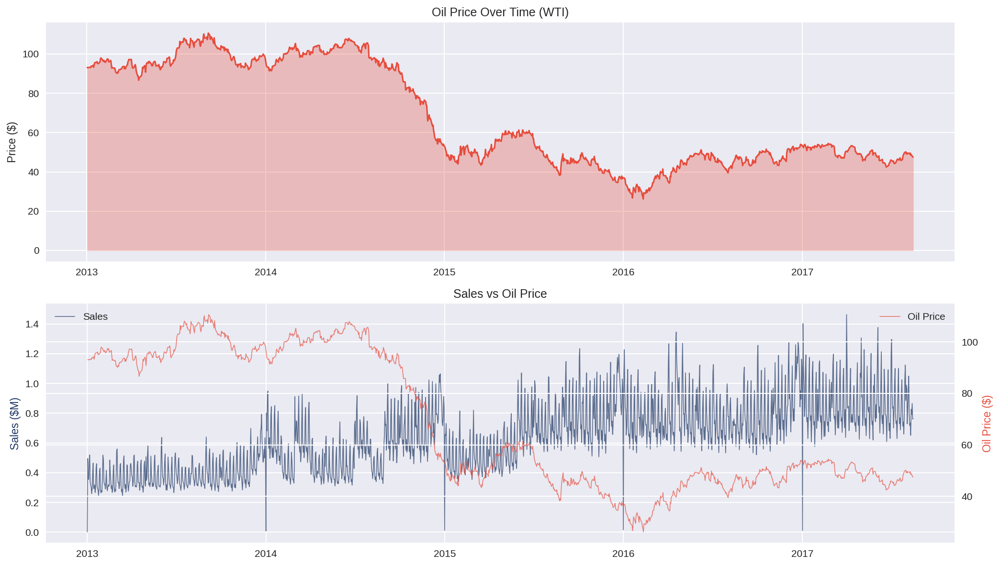
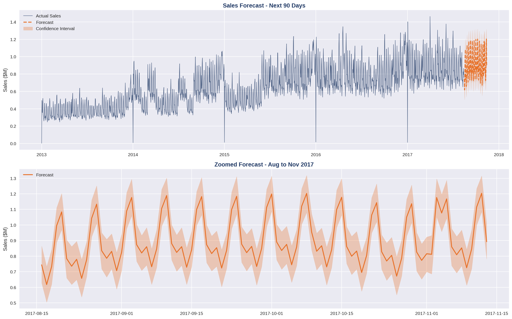
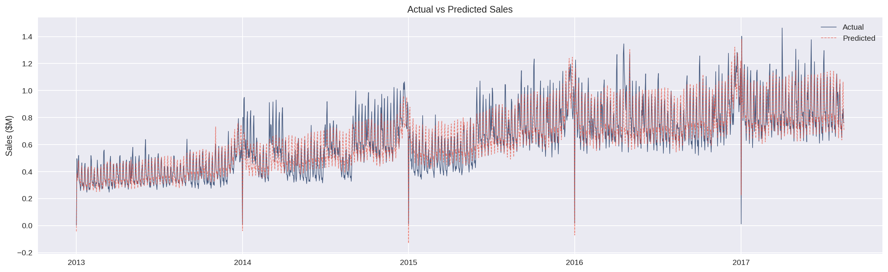

# 🏪 Store Sales - Time Series Forecasting
Python | Pandas | Prophet | Matplotlib | Seaborn

---

## 📌 Overview

3 million rows. 54 stores. 33 product families.
4 years of daily sales data from Ecuador.

This project goes beyond simple forecasting - it combines trend analysis, seasonality patterns, external macro signals and store-level performance gaps to give management a clear picture of what drives sales and what to do about it.

---

## 🗂️ Dataset

**Source:** [Store Sales - Time Series Forecasting — Kaggle](https://www.kaggle.com/competitions/store-sales-time-series-forecasting)

- 3,000,888 transaction lines
- 54 stores across Ecuador (2013-2017)
- 33 product families
- External data : oil prices, national holidays, store metadata

---

## 🛠️ Tools and Skills

| Skill | Detail |
|---|---|
| **Data Preparation** | Interpolation, feature engineering, merging |
| **EDA** | Trend, seasonality, correlations |
| **External Signals** | Oil price impact, holiday analysis |
| **Store Analysis** | Performance by type, top and bottom stores |
| **Forecasting** | Prophet base and improved with regressors |
| **Evaluation** | MAE, RMSE, MAPE — before and after comparison |
| **Visualization** | Heatmap, time series, bar charts, components |

---

## 📊 Analysis Structure

### 🔍 Data Exploration
- 4 datasets loaded and merged
- Missing oil prices interpolated
- Daily aggregation across all stores
- Feature engineering : Year, Month, Day of Week, Month Name

### 📈 Sales Trends
- Global KPIs : $881M total sales (2013-2017)
- Annual growth : +49% in 2014, +15% in 2015, +20% in 2016
- Monthly and daily seasonality patterns

### 🏪 Store Performance
- Sales by store type (A B C D E)
- Top 10 and Bottom 10 individual stores
- Type A vs Type C performance gap analysis

### 📦 Product Families
- Top 10 families by total sales
- Top 5 families evolution over time

### 🔗 External Signals
- Promotions correlation : +0.575 with sales
- Oil price correlation : -0.628 with sales
- National holiday impact : -6.3% on average

### 🔮 Forecasting
- Base Prophet model : MAPE 14.75%
- Improved Prophet with oil and promotions as external regressors : MAPE 14.06%
- 90-day forecast : $725K to $1.2M per day

---

## 🔍 What the Data Actually Says

### 📈 Four Years of Consistent Growth
Sales more than doubled from $140M in 2013 to $289M in 2016. Average daily sales climbed from $385K to $791K. The structural momentum is real and worth building on.

### 🏪 The Store Performance Gap
Type A stores generate $39M per store on average.
Type C stores generate $11M. That is a 3.5x gap across a network of 54 stores. With 15 Type C stores in the network, understanding what Type A does differently is one of the highest-value questions this data can answer.

### 🛒 Five Families Drive Everything
Grocery I alone accounts for $343M in total sales.
The top 5 families generate approximately 78% of total revenue. The remaining 28 families share the other 22%. A rationalization review of the bottom performers could free up margin and shelf space for higher-return categories.

### ⛽ Oil Price as a Leading Indicator
Oil price correlates at -0.628 with sales.
In an oil-dependent economy like Ecuador, a sustained drop below $60/barrel has historically preceded pressure on consumer spending.
This is a macro early warning signal no internal data source can replicate.

### 📅 Weekends Change Everything
Weekend sales average $1.1M versus $638K on weekdays - consistently 72% higher.
National holidays reduce average sales by 6%.
The pattern is stable enough to plan around.

### 🔮 The Forecast
Base Prophet achieves 14.75% MAPE on a dataset averaging 54 stores and 33 product families.
Adding oil price and promotions as regressors improved it to 14.06%. The remaining gap is structural - a store-level model would push MAPE below 10% and is the logical next step.

---

## 💡 Three Things Worth Acting On

| Priority | Action |
|---|---|
| 1 | Benchmark Type A stores against Type C — the 3.5x gap is too large to ignore |
| 2 | Set an oil price alert at $60/barrel as a macro demand signal |
| 3 | Use the forecast to align staffing and inventory with weekend and seasonal peaks |

---

## 📊 Visualizations

### Sales Trend


### Seasonality Heatmap


### Top Product Families


### Family Evolution Over Time


### Store Type Performance


### Oil Price Impact


### 90-Day Forecast


### Actual vs Predicted


---

## 📁 Repository Structure

```
Store-Sales-Time-Series-Forecasting/
├── README.md
├── Store_Sales_Time_Series_Forecasting.ipynb
└── assets/
    ├── sales_trend.png
    ├── heatmap_seasonality.png
    ├── family_sales.png
    ├── family_evolution.png
    ├── store_type_analysis.png
    ├── oil_impact.png
    ├── forecast.png
    └── actual_vs_predicted.png
```
---

## 🔗 Related Projects

- [Mall Customer Segmentation](https://github.com/diahandahame/Mall-Customer-Segmentation)
- [Superstore - Python EDA](https://github.com/diahandahame/Superstore-Python-EDA)
- [Superstore - Power BI Dashboard](https://github.com/diahandahame/Superstore-PowerBI-Dashboard)
- [AdventureWorks - Advanced SQL Analysis](https://github.com/diahandahame/AdventureWorks-SQL-Analysis)

---

## 👤 Author

**Handahamé DIA** - Quantitative Economist | Business Analyst

[](https://www.linkedin.com/in/handahame-dia/)
[](https://github.com/diahandahame)
